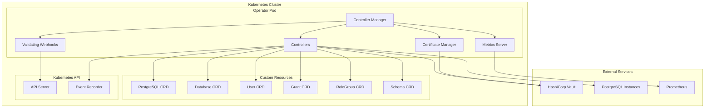
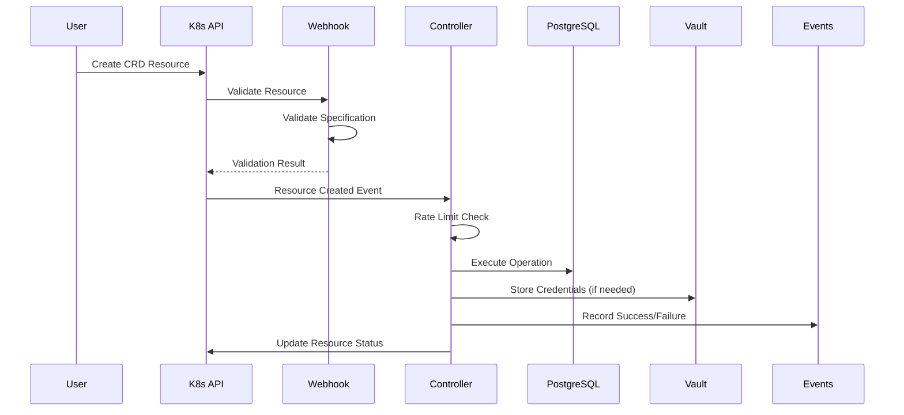
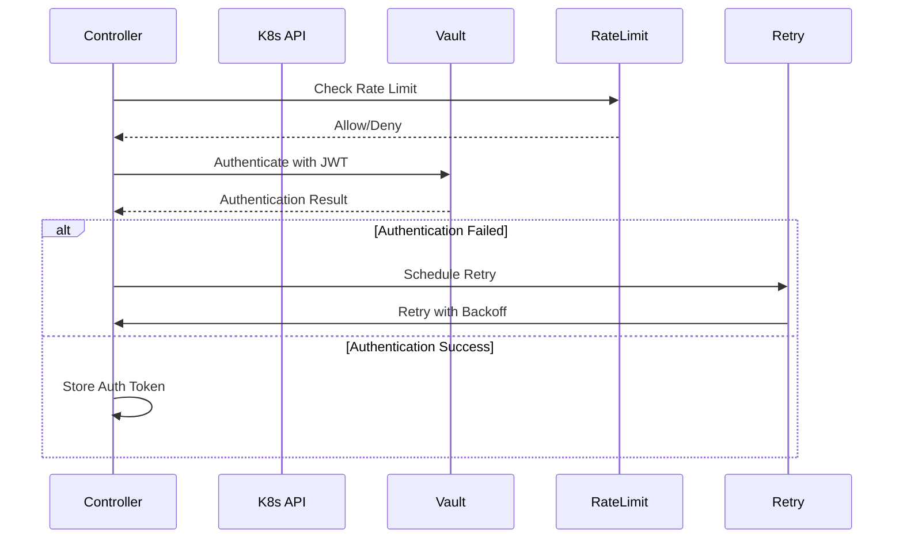
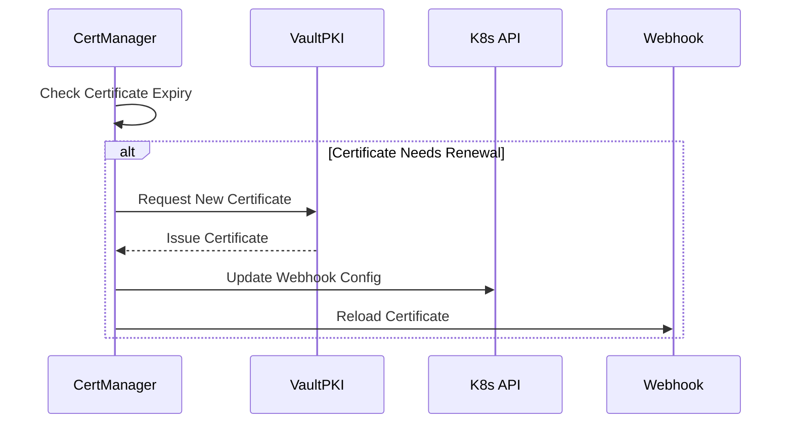

# Architecture Guide

This document provides a comprehensive overview of the k8s-postgresql-operator architecture, including component interactions, data flows, and design decisions.

## Overview

The k8s-postgresql-operator is a Kubernetes operator built using the [Kubebuilder](https://book.kubebuilder.io/) framework. It follows the operator pattern to manage PostgreSQL resources declaratively through Custom Resource Definitions (CRDs).

## High-Level Architecture

## Core Components

### 1. Controller Manager

The controller manager is the main entry point that orchestrates all operator components:

- **Initialization**: Sets up logging, configuration, and dependencies
- **Component Coordination**: Manages controllers, webhooks, and certificate providers
- **Health Checks**: Provides readiness and liveness probes
- **Graceful Shutdown**: Handles termination signals and cleanup

**Key Features:**
- Leader election for high availability
- Structured JSON logging with configurable levels
- Metrics server for Prometheus integration
- Signal handling for graceful shutdown

### 2. Controllers

Controllers implement the reconciliation logic for each CRD type. They follow the Kubernetes controller pattern with watch-reconcile loops.

#### Base Reconciler

All controllers inherit from a base reconciler that provides:

- **Common Reconciliation Logic**: Shared patterns for all resource types
- **Error Handling**: Standardized error processing and event recording
- **Rate Limiting**: Configurable rate limiting for external service calls
- **Retry Logic**: Exponential backoff for transient failures
- **Metrics Collection**: Performance and operational metrics

#### PostgreSQL Controller

Manages PostgreSQL instance resources:

- **Connection Validation**: Tests connectivity to PostgreSQL instances
- **Status Management**: Updates connection status and health information
- **Event Recording**: Records connection events and failures

**Reconciliation Flow:**
1. Validate PostgreSQL instance configuration
2. Test database connectivity with retry logic
3. Update status conditions
4. Record events for success/failure

#### Database Controller

Manages database lifecycle:

- **Database Creation**: Creates databases with optional templates
- **Owner Management**: Sets database ownership
- **Deletion Handling**: Optional database deletion on CRD removal

**Reconciliation Flow:**
1. Verify PostgreSQL instance exists and is connected
2. Check if database exists
3. Create database if needed (with template if specified)
4. Set database owner
5. Handle deletion if `deleteFromCRD` is true

#### User Controller

Manages PostgreSQL user lifecycle:

- **User Creation**: Creates PostgreSQL users
- **Password Management**: Generates and stores passwords in Vault
- **Password Updates**: Handles password rotation
- **Exclusion Logic**: Respects excluded user list

**Reconciliation Flow:**
1. Check if user is in exclusion list
2. Verify PostgreSQL instance connectivity
3. Generate password if user doesn't exist
4. Store credentials in Vault
5. Create/update PostgreSQL user
6. Handle password updates if requested

#### Grant Controller

Manages PostgreSQL permissions:

- **Permission Application**: Applies table, schema, and database grants
- **Grant Types**: Supports multiple grant types (table, schema, database, sequence, function)
- **Privilege Management**: Manages SELECT, INSERT, UPDATE, DELETE, and other privileges

**Reconciliation Flow:**
1. Validate grant configuration
2. Verify target database and role exist
3. Apply grants based on type and privileges
4. Record success/failure events

#### RoleGroup Controller

Manages role group membership:

- **Role Assignment**: Adds users to role groups
- **Membership Management**: Maintains role group membership
- **Role Creation**: Creates role groups if they don't exist

#### Schema Controller

Manages database schema lifecycle:

- **Schema Creation**: Creates database schemas
- **Owner Management**: Sets schema ownership
- **Permission Setup**: Configures schema permissions

### 3. Validating Webhooks

Webhooks provide admission control for all CRD types, validating resources before they're stored in etcd.

#### Webhook Architecture

- **Admission Controller**: Intercepts CREATE/UPDATE operations
- **Validation Logic**: Validates resource specifications
- **Error Responses**: Returns detailed validation errors
- **Certificate Management**: Handles TLS certificates for webhook server

#### Validation Types

**PostgreSQL Validator:**
- Connection parameter validation
- SSL mode validation
- Address and port validation

**User Validator:**
- Username format validation
- Exclusion list checking
- PostgreSQL instance reference validation

**Database Validator:**
- Database name validation
- Owner reference validation
- Template database validation

**Grant Validator:**
- Grant type validation
- Privilege validation
- Target resource validation

**RoleGroup Validator:**
- Role group name validation
- Role list validation

**Schema Validator:**
- Schema name validation
- Owner validation
- Database reference validation

### 4. Certificate Management

The operator supports multiple certificate providers for webhook TLS certificates:

#### Certificate Provider Selection

1. **Provided Certificates**: Use existing certificates from specified directory
2. **Vault PKI**: Issue certificates from Vault PKI secrets engine
3. **Self-Signed**: Generate self-signed certificates (default)

#### Vault PKI Provider

- **Certificate Issuance**: Requests certificates from Vault PKI
- **Automatic Renewal**: Renews certificates before expiry
- **CA Bundle Management**: Updates webhook configurations with CA bundle

#### Self-Signed Provider

- **Certificate Generation**: Creates self-signed certificates
- **CA Bundle Creation**: Generates CA bundle for webhook configuration

### 5. Vault Integration

Comprehensive integration with HashiCorp Vault for credential storage and certificate management.

#### Vault Client

- **Kubernetes Authentication**: Uses service account tokens for authentication
- **Token Management**: Handles token renewal and expiration
- **Rate Limiting**: Configurable rate limiting for Vault API calls
- **Retry Logic**: Exponential backoff for Vault operations

#### Credential Storage

- **Path Structure**: `{mount_point}/data/{secret_path}/{instance_type}/{uuid}/{username}`
- **Metadata Storage**: Stores creation/update timestamps
- **Secure Storage**: Uses Vault KV v2 secrets engine

#### PKI Integration

- **Certificate Issuance**: Issues webhook certificates from Vault PKI
- **Automatic Renewal**: Monitors certificate expiry and renews automatically
- **CA Management**: Retrieves CA certificates for webhook configuration

### 6. Rate Limiting

Configurable rate limiting prevents overwhelming external services.

#### Rate Limiter Implementation

- **Token Bucket Algorithm**: Uses golang.org/x/time/rate package
- **Per-Service Limiting**: Separate limits for PostgreSQL and Vault
- **Burst Support**: Allows traffic bursts within limits
- **Metrics Integration**: Records rate limiting events

#### Configuration

- **PostgreSQL Rate Limiting**: Configurable requests per second and burst
- **Vault Rate Limiting**: Separate configuration for Vault API calls
- **Dynamic Updates**: Rate limits can be updated at runtime

### 7. Retry Logic

Exponential backoff retry logic handles transient failures gracefully.

#### Retry Configuration

- **Initial Interval**: Starting delay for retries
- **Maximum Interval**: Cap on retry delays
- **Maximum Elapsed Time**: Total time limit for all retries
- **Multiplier**: Growth factor for retry intervals
- **Randomization Factor**: Jitter to prevent thundering herd

#### Retry Scenarios

- **PostgreSQL Connection Failures**: Network issues, temporary unavailability
- **Vault Authentication Failures**: Token expiry, network issues
- **Certificate Renewal Failures**: PKI unavailability

### 8. Event Recording

Comprehensive Kubernetes event recording for operational visibility.

#### Event Types

- **Normal Events**: Successful operations (Created, Updated, Connected, Synced)
- **Warning Events**: Failures and errors (CreateFailed, ConnectionFailed, VaultError)

#### Event Categories

- **Resource Lifecycle**: Creation, update, deletion events
- **Connection Events**: PostgreSQL and Vault connectivity
- **Validation Events**: Webhook validation results
- **Certificate Events**: Certificate issuance and renewal

### 9. Metrics and Monitoring

Built-in Prometheus metrics for operational monitoring.

#### Metrics Categories

**Object Metrics:**
- `postgresql_operator_object_count`: Count of objects per type and PostgreSQL ID
- `postgresql_operator_object_info`: Object information and metadata

**Performance Metrics:**
- `postgresql_operator_reconcile_duration_seconds`: Reconciliation performance
- `postgresql_operator_vault_auth_duration_seconds`: Vault authentication timing

**Rate Limiting Metrics:**
- `postgresql_operator_rate_limit_wait_total`: Rate limiting events
- `postgresql_operator_rate_limit_allow_total`: Rate limiting decisions

**Retry Metrics:**
- `postgresql_operator_retry_attempts_total`: Retry attempt counts
- `postgresql_operator_retry_duration_seconds`: Retry operation timing

## Data Flow

### 1. Resource Creation Flow

### 2. Vault Authentication Flow

### 3. Certificate Management Flow

## Design Decisions

### 1. Controller Architecture

**Decision**: Use separate controllers for each CRD type
**Rationale**: 
- Clear separation of concerns
- Independent scaling and error handling
- Easier testing and maintenance

### 2. Webhook Validation

**Decision**: Implement validating webhooks for all CRDs
**Rationale**:
- Prevent invalid resources from being stored
- Provide immediate feedback to users
- Reduce controller reconciliation overhead

### 3. Vault Integration

**Decision**: Use Vault for credential storage and certificate management
**Rationale**:
- Secure credential storage with encryption at rest
- Centralized secret management
- Audit logging and access control
- PKI capabilities for certificate management

### 4. Rate Limiting

**Decision**: Implement rate limiting for external service calls
**Rationale**:
- Prevent overwhelming PostgreSQL and Vault
- Provide backpressure during high load
- Improve system stability and reliability

### 5. Exponential Backoff

**Decision**: Use exponential backoff with jitter for retries
**Rationale**:
- Handle transient failures gracefully
- Prevent thundering herd problems
- Configurable parameters for different environments

### 6. Event Recording

**Decision**: Comprehensive event recording for all operations
**Rationale**:
- Operational visibility and debugging
- Integration with Kubernetes event system
- Audit trail for compliance

## Security Considerations

### 1. Credential Management

- **Vault Integration**: All credentials stored in Vault with encryption
- **Token Rotation**: Automatic token renewal and rotation
- **Least Privilege**: Minimal required permissions for Vault access

### 2. Network Security

- **TLS Encryption**: All external communications use TLS
- **Certificate Validation**: Proper certificate validation for all connections
- **Network Policies**: Support for Kubernetes network policies

### 3. RBAC

- **Minimal Permissions**: Operator uses least privilege RBAC
- **Service Account**: Dedicated service account with specific permissions
- **Webhook Security**: TLS-secured webhook endpoints

## Scalability Considerations

### 1. Leader Election

- **High Availability**: Multiple replicas with leader election
- **Graceful Failover**: Automatic leader transition
- **Split-Brain Prevention**: Kubernetes-native leader election

### 2. Rate Limiting

- **Configurable Limits**: Adjustable based on infrastructure capacity
- **Burst Handling**: Support for traffic spikes
- **Per-Service Limits**: Independent limits for different services

### 3. Resource Management

- **Memory Efficiency**: Efficient resource usage and garbage collection
- **CPU Optimization**: Optimized reconciliation loops
- **Horizontal Scaling**: Support for multiple operator replicas

## Monitoring and Observability

### 1. Metrics

- **Prometheus Integration**: Native Prometheus metrics
- **Custom Metrics**: Operator-specific performance metrics
- **Rate Limiting Metrics**: Visibility into rate limiting behavior

### 2. Logging

- **Structured Logging**: JSON-formatted logs for parsing
- **Configurable Levels**: Debug, info, warn, error levels
- **Contextual Information**: Rich context in log messages

### 3. Events

- **Kubernetes Events**: Integration with native event system
- **Event Categories**: Categorized events for filtering
- **Event Retention**: Configurable event retention policies

## Future Enhancements

### 1. Multi-Tenancy

- **Namespace Isolation**: Support for namespace-scoped operations
- **Resource Quotas**: Integration with Kubernetes resource quotas
- **RBAC Integration**: Enhanced RBAC for multi-tenant scenarios

### 2. Advanced Features

- **Backup Integration**: Integration with PostgreSQL backup solutions
- **Migration Support**: Database migration and schema evolution
- **Connection Pooling**: Integration with connection pooling solutions

### 3. Observability

- **Distributed Tracing**: OpenTelemetry integration for tracing
- **Advanced Metrics**: More detailed performance metrics
- **Alerting Rules**: Predefined alerting rules for common issues